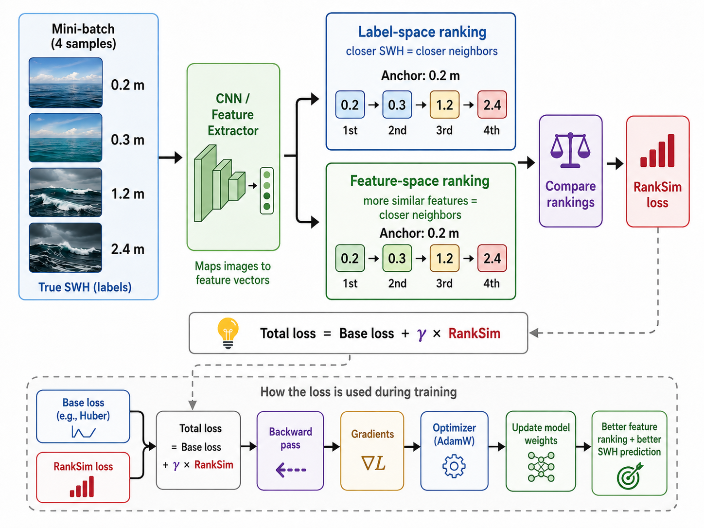

# RankSim Learning Notes for Deep Imbalanced Regression

**Project context:** Significant Wave Height (SWH) estimation from coastal webcam images  
**Primary use here:** RankSim regularization with InceptionV3/ResNet-50 feature embeddings and a regression loss such as Huber  
**Learning goal:** Understand RankSim deeply enough to explain it to a professor, implement/debug it in PyTorch, and connect it to broader machine-learning engineering concepts.

---

## 1. One-sentence idea

**RankSim encourages samples that are close in continuous label space to have a similar neighbor ordering in learned feature space.**

For SWH estimation, if a 0.20 m sample is closer in SWH to 0.30 m than to 1.20 m or 2.40 m, RankSim tries to make the learned feature representation preserve that same ordering.

---

## 2. Why RankSim exists

Deep regression models trained on imbalanced data can become biased toward densely populated target regions.

In SWH estimation, calm or low-wave conditions may be common, while high-SWH conditions are rare. A conventional regression loss such as MSE or Huber only asks:

> “Is the final predicted SWH numerically close to the target?”

That is necessary, but it does **not explicitly tell the feature extractor how continuous targets should be organized in representation space**.

RankSim adds a second learning objective:

> “The relative neighborhood structure in feature space should follow the relative neighborhood structure in SWH label space.”

This is why RankSim is a **regularizer**, not a replacement for the base regression loss.

---

## 3. Visual intuition



The core flow is:

```text
Mini-batch of images + true SWH
            |
            v
      CNN feature extractor
            |
            +-----------------------------+
            |                             |
            v                             v
   Label-space ranking            Feature-space ranking
   based on SWH distance          based on cosine similarity
            |                             |
            +-------------+---------------+
                          |
                          v
                 Compare the rankings
                          |
                          v
                    RankSim loss
                          |
                          v
Total loss = Base regression loss + gamma * RankSim loss
                          |
                          v
                 Backward + Optimizer
```

---

# 4. RankSim versus the methods that change sampling or weighting

It is important to distinguish the mechanism.

| Method type | What it changes |
|---|---|
| Plain Huber/MSE/MRE | How prediction error is penalized |
| Stratified Sampler | Which samples enter each mini-batch |
| LDS | How much each sample's base loss is weighted |
| RankSim | How learned feature relationships are organized |
| ConR | Adds a contrastive-style representation regularizer |

RankSim **does not rebalance the DataLoader** and **does not replace the base loss**.

---

# 5. Notation

Consider a mini-batch or selected subset of samples:

\[
\mathcal{M} = \{(x_i, y_i)\}_{i=1}^{M}
\]

where:

- \(x_i\): input image
- \(y_i\): continuous target, here SWH in meters
- \(f(x_i;\theta)\): CNN feature extractor
- \(z_i = f(x_i;\theta)\): learned feature representation
- \(S^y\): pairwise similarity matrix in label space
- \(S^z\): pairwise similarity matrix in feature space
- \(\mathrm{rk}(\cdot)\): ranking operator
- \(L_{\text{RankSim}}\): ranking-similarity regularization loss
- \(\gamma\): weight of the RankSim regularizer in total training loss
- \(\lambda\): interpolation strength used by the differentiable ranking operator

---

# 6. Step 1: Build label-space relationships

For scalar regression labels, the RankSim paper uses **negative absolute distance** as label similarity:

\[
S^y_{ij} = -|y_i-y_j|
\]

Why negative?

Because a smaller label distance means “more similar.” Negating the distance makes closer labels have larger similarity values.

### SWH toy batch

Assume:

\[
y = [0.20,\ 0.30,\ 1.20,\ 2.40]\text{ m}
\]

Take 0.20 m as the anchor.

Absolute SWH distances are:

\[
|0.20-0.20|=0
\]

\[
|0.20-0.30|=0.10
\]

\[
|0.20-1.20|=1.00
\]

\[
|0.20-2.40|=2.20
\]

Therefore the desired neighbor order is:

```text
0.20 m  ->  0.30 m  ->  1.20 m  ->  2.40 m
closest                                      farthest
```

This ordering is determined only from the true labels.

---

# 7. Step 2: Extract deep features

In the project's InceptionV3 RankSim model, the CNN produces a **2048-dimensional penultimate feature vector** before the final regression head.

Conceptually:

```text
Image
  |
  v
InceptionV3 backbone
  |
  v
2048-D feature z
  |
  v
Regression head
  |
  v
Predicted SWH
```

The base regression loss uses the final prediction.

RankSim uses the **2048-D features**.

This is why the RankSim/ConR model implementation needs a split such as:

```python
features = model.forward_features(images)
pred = model.forward_head(features)
```

---

# 8. Step 3: Build feature-space similarities

For feature vectors \(z_i\) and \(z_j\), the implementation uses cosine similarity:

\[
S^z_{ij}
=
\frac{z_i^\top z_j}
{\|z_i\|_2\|z_j\|_2}
\]

Cosine similarity focuses on the angle/direction of the feature vectors.

- similarity near 1: very similar direction
- similarity near 0: weak relationship
- similarity near -1: opposite direction

The implementation normalizes all feature vectors and uses matrix multiplication to obtain the full pairwise cosine-similarity matrix.

Equivalent conceptual PyTorch operation:

```python
z = F.normalize(features, dim=1)
S_z = z @ z.T
```

For batch size \(B\), the similarity matrix has shape:

\[
B \times B
\]

---

# 9. Step 4: Convert similarities into rankings

RankSim does not primarily force exact similarity values.

Instead, it asks:

> “Is the order of neighbors correct?”

For each anchor sample, RankSim produces:

1. a **label-space rank**
2. a **feature-space rank**

### Example

Desired label ranking for anchor 0.20 m:

```text
[0.20, 0.30, 1.20, 2.40]
```

Suppose the learned features currently produce:

```text
[0.20, 1.20, 0.30, 2.40]
```

The network has incorrectly placed 1.20 m ahead of 0.30 m.

RankSim penalizes this disagreement.

---

# 10. Normalized ranking used in the project

The project's ranking implementation returns **normalized ranks in (0, 1]**.

With four items, possible normalized ranks are:

\[
[0.25,\ 0.50,\ 0.75,\ 1.00]
\]

The implementation's direction convention assigns:

- lower normalized rank to the most similar / highest-valued similarity
- higher normalized rank to the least similar / lowest-valued similarity

Therefore:

```text
most similar       -> 0.25
second most similar -> 0.50
third               -> 0.75
least similar       -> 1.00
```

---

# 11. Step 5: Calculate the RankSim loss

For each anchor, the implementation compares:

\[
r_i^y = \text{label-space rank vector}
\]

and

\[
r_i^z = \text{feature-space rank vector}
\]

using mean squared error:

\[
L_i^{RankSim}
=
\mathrm{MSE}(r_i^z,r_i^y)
\]

Then it averages across anchors.

\[
L_{RankSim}
=
\frac{1}{M}
\sum_{i=1}^{M}
L_i^{RankSim}
\]

### Numeric example

Suppose:

\[
r^y=[0.25,\ 0.50,\ 0.75,\ 1.00]
\]

and:

\[
r^z=[0.25,\ 0.75,\ 0.50,\ 1.00]
\]

Then:

\[
L_i =
\frac{
(0.25-0.25)^2+
(0.75-0.50)^2+
(0.50-0.75)^2+
(1.00-1.00)^2
}{4}
\]

\[
=
\frac{0+0.0625+0.0625+0}{4}
\]

\[
=
0.03125
\]

If the rankings match perfectly:

\[
r_i^z=r_i^y
\]

then:

\[
L_i^{RankSim}=0
\]

---

# 12. Step 6: The project also removes duplicate target values inside a batch

The actual `batchwise_ranking_regularizer()` first finds unique target values.

If the same target value occurs multiple times, it randomly keeps at most one sample for each unique target value.

Purpose:

- reduce ranking ties
- increase the relative influence of infrequent target values inside the ranking subset

This step comes directly from the RankSim reference implementation.

Important:

**This is not the same as Stratified Sampling.**

It does not construct the original DataLoader batch. It creates a ranking subset **inside the current batch**.

---

# 13. Step 7: Why differentiable ranking is needed

A normal sorting/ranking operation is not useful for standard gradient descent.

The reason is simple:

If the input values change slightly but their ordering does not change, the rank stays exactly the same.

Therefore the ordinary rank function is piecewise constant and has zero/uninformative gradients almost everywhere.

RankSim solves this using a differentiable black-box ranking technique.

The project uses `TrueRanker`.

### Forward

The forward pass computes the actual normalized ranking.

### Backward

Instead of using the ordinary zero gradient, the operator perturbs the similarity scores using the incoming gradient:

\[
a_\lambda = a+\lambda\frac{\partial L}{\partial rk}
\]

It recomputes the ranking and approximates a useful gradient:

\[
\frac{\partial L}{\partial a}
\approx
-\frac{1}{\lambda}
\left(
rk(a)-rk(a_\lambda)
\right)
\]

This allows RankSim loss to send learning signals back into the CNN features.

---

# 14. What lambda means

The project parameter:

```text
interp_strength_lambda = 1.0
```

is **not a loss weight**.

It belongs to the differentiable-ranking operator.

It controls the perturbation/interpolation used to obtain informative gradients through ranking.

A useful mental model:

```text
lambda
   |
   v
How the non-differentiable rank operation is approximated during backward
```

Do not confuse it with gamma.

---

# 15. What gamma means

The project parameter:

```text
gamma = 1.0
```

is the weight given to RankSim in the total training objective.

\[
L_{total}
=
L_{base}
+
\gamma L_{RankSim}
\]

So:

- \(\gamma=0\): RankSim has no effect
- larger \(\gamma\): ranking regularization contributes more strongly
- too large \(\gamma\): feature-ranking objective may compete too strongly with the direct regression objective

---

# 16. The actual current SWH RankSim configuration

For the provided `inceptionv3_full_raw_huber_ranksim` configuration:

```text
Backbone                  InceptionV3
Input size                299 x 299
Pretrained                ImageNet
Penultimate feature       2048-D
Regression target         raw SWH in meters
Base loss                 Huber
Batch size                32
Optimizer                 AdamW
Learning rate             1e-4
Weight decay              1e-4
RankSim lambda             1.0
RankSim gamma              1.0
Validation monitor         val_huber
```

**Important implementation note:** some comments inherited from earlier templates mention MSE when describing RankSim, but the actual provided configuration explicitly sets:

```yaml
training:
  loss: huber
```

Therefore, for this run, the conceptual total objective is:

\[
L_{total}
=
L_{Huber}
+
1.0\times L_{RankSim}
\]

---

# 17. Full training flow in the SWH experiment

For one mini-batch:

```text
1. Load webcam images and raw SWH targets
                 |
                 v
2. InceptionV3 forward_features()
                 |
                 v
       2048-D feature vectors
          /                 \
         /                   \
        v                     v
3A. Regression head      3B. RankSim branch
        |                     |
        v                     v
Predicted SWH         Label and feature rankings
        |                     |
        v                     v
4A. Base Huber loss       RankSim loss
         \                   /
          \                 /
           v               v
     5. Total training loss
     L = Huber + gamma * RankSim
                 |
                 v
        6. backward()
                 |
                 v
Gradients through regression head and feature extractor
                 |
                 v
         7. AdamW step
                 |
                 v
          Updated weights
```

---

# 18. Does RankSim itself get optimized?

Yes, but the wording should be precise.

RankSim is a **loss term**, not a separate trainable neural network.

There are no ordinary trainable RankSim weights that are independently optimized.

Instead:

1. RankSim loss is calculated from current CNN features.
2. `backward()` computes gradients of that loss with respect to those features.
3. Those gradients propagate into the feature extractor.
4. AdamW updates the CNN/model parameters.
5. Future features therefore tend to produce better SWH-consistent rankings.

Thus:

> **The model parameters are optimized to reduce both the base regression loss and the RankSim regularization loss.**

---

# 19. Base-loss gradient and RankSim gradient work together

Assume:

\[
L_{Huber}=0.080
\]

\[
L_{RankSim}=0.03125
\]

and:

\[
\gamma=1.0
\]

Then:

\[
L_{total}=0.080+0.03125=0.11125
\]

During backpropagation:

\[
\nabla_\theta L_{total}
=
\nabla_\theta L_{Huber}
+
\gamma\nabla_\theta L_{RankSim}
\]

Interpretation:

```text
Huber gradient:
"Make the predicted SWH numerically correct."

RankSim gradient:
"Make the learned representation respect the SWH ordering."

Combined gradient:
"Improve prediction while learning a more meaningful continuous feature space."
```

---

# 20. Why this can help imbalanced regression

Imagine a rare high-SWH sample.

A conventional model may see very few examples from that region and learn a weak representation.

RankSim can still obtain information from the **relationship between that rare target and other targets**.

Example:

```text
0.30 m <-> 0.50 m <-> 0.90 m <-> 1.40 m <-> 2.30 m
```

The training signal is no longer only:

```text
"Predict 2.30 correctly."
```

It additionally says:

```text
"2.30 should be farther from low-SWH samples than from nearby high-SWH samples."
```

This exploits the natural ordering of continuous regression labels.

---

# 21. Local versus global relationship

This is an important idea from the RankSim paper.

Some smoothing techniques mainly exploit **nearby** label relationships.

RankSim explicitly considers the **complete ranking of neighbors**.

Therefore it captures both:

- nearby relationships
- distant relationships

For an anchor at 0.30 m:

```text
0.35 m should be very close
0.60 m somewhat close
1.20 m farther
2.40 m much farther
```

RankSim attempts to preserve this full relative ordering.

---

# 22. When RankSim is useful

RankSim is especially attractive when:

1. **The output is continuous and naturally ordered**
   - age
   - depth
   - wave height
   - temperature
   - price
   - severity scores

2. **The target distribution is imbalanced**
   - many samples around common values
   - few samples in rare/extreme regions

3. **Representation quality matters**
   - transfer learning
   - retrieval
   - generalization to rare labels
   - downstream tasks using embeddings

4. **Neighbor relationships contain useful information**

5. **Feature embeddings are available during training**

---

# 23. When RankSim may be less useful

RankSim is not automatically beneficial.

Potential limitations:

### A. Very small batches

RankSim works batch-wise.

With few samples, there are fewer pairwise relationships and rankings may be less informative.

### B. Noisy targets

If SWH measurements are noisy, label ordering can occasionally be misleading.

### C. Weak semantic relationship between label distance and visual similarity

RankSim assumes that closeness in label space should correspond to meaningful structure in feature space.

That may not hold equally well for every problem.

### D. Computational overhead

Pairwise similarity produces an \(M\times M\) matrix.

Thus the cost grows roughly quadratically with the number of selected batch samples for that component.

### E. Hyperparameter balance

Poor choices of gamma or lambda can reduce benefit.

---

# 24. RankSim is not the same as metric learning, but it is related

RankSim has a strong conceptual connection to:

- metric learning
- representation learning
- contrastive learning
- learning to rank
- ordinal regression

But it is different from a simple contrastive loss.

A contrastive method may say:

```text
positive pair -> pull together
negative pair -> push apart
```

RankSim says something richer:

```text
For an anchor, preserve the entire relative ordering of neighbors.
```

This is a useful distinction in interviews.

---

# 25. Real-world applications

The RankSim principle can be applied to many continuous regression problems.

### Computer vision

- age estimation from face images
- depth estimation
- crowd-density regression
- medical severity estimation
- body measurement estimation
- material property prediction from images

### Robotics and perception

- distance/depth prediction
- terrain roughness estimation
- traversability score estimation
- object range estimation
- environmental-state estimation

### Marine and ocean engineering

- significant wave height
- wave period or sea-state severity
- wind-wave condition estimation
- ice concentration/severity scores
- underwater visibility or turbidity estimation

### Industrial AI

- remaining useful life
- equipment degradation
- quality scores
- manufacturing process variables
- demand and price regression

---

# 26. Why this concept matters for an ML / Deep Learning Engineer

RankSim teaches several broader skills that are much more important than memorizing one paper.

## 26.1 Loss design

A good engineer should understand that the learning objective determines what the network is encouraged to learn.

You should be able to distinguish:

```text
prediction loss
sample weighting
sampling strategy
representation regularization
```

## 26.2 Representation learning

Modern deep learning is not only about the final output.

The structure of the internal embedding often controls generalization.

## 26.3 Pairwise computation

RankSim uses pairwise feature relationships.

This pattern appears in:

- contrastive learning
- triplet loss
- retrieval systems
- metric learning
- graph construction
- nearest-neighbor methods

## 26.4 Differentiability

Sorting and ranking are naturally non-differentiable.

RankSim is an example of a broader engineering problem:

> “How can we optimize a useful but non-differentiable operation inside a neural network?”

This concept appears in:

- top-k selection
- sorting
- discrete optimization
- assignment problems
- matching
- structured prediction

## 26.5 Debugging tensor shapes

RankSim requires careful tensor reasoning:

```text
features         [B, D]
normalized feats [B, D]
similarity       [B, B]
rank row         [1, B]
```

This type of shape reasoning is a core industry skill.

## 26.6 Designing fair ablations

If RankSim is added to a baseline, you should keep other variables fixed:

- backbone
- split
- optimizer
- learning rate
- augmentations
- evaluation metrics

Then the performance difference can be attributed more confidently to the regularizer.

---

# 27. Questions a professor may ask

### Q1. What is the one-sentence motivation?

Samples close in SWH should have a similar neighbor ordering in learned feature space.

### Q2. Does RankSim replace Huber/MSE?

No. It is added as a regularization term.

### Q3. Where does RankSim act?

On penultimate learned features, not directly only on the scalar prediction.

### Q4. How is label similarity measured?

Negative absolute distance between continuous target values.

### Q5. How is feature similarity measured?

Cosine similarity in the implementation used here.

### Q6. What exactly is compared?

The ranking of neighbors in label space versus the ranking of neighbors in feature space.

### Q7. What penalty compares the two rankings?

MSE between normalized ranking vectors.

### Q8. Why does RankSim need special differentiation?

Ordinary ranking is piecewise constant and non-differentiable for normal gradient-based learning.

### Q9. What is gamma?

The weight of RankSim in the total loss.

### Q10. What is lambda?

A parameter of the differentiable-ranking approximation, not the regularization weight.

### Q11. Why might RankSim help rare SWH regions?

It uses relationships among continuous labels to organize representations, so rare targets can benefit from their relative position to other targets.

### Q12. Does it explicitly give higher loss weight to rare samples?

No. That is not its primary mechanism. It changes representation structure.

### Q13. Does it change the DataLoader?

No.

### Q14. Does it require bins?

No. Its core relationship uses continuous labels directly.

### Q15. What happens with repeated target values?

The reference implementation keeps at most one example per unique target value in the ranking subset to reduce ties.

---

# 28. Questions likely in ML / DL interviews

### Concept questions

- What is regularization?
- What is representation learning?
- Why can a good feature space improve generalization?
- Difference between cosine similarity and Euclidean distance?
- Difference between ranking loss and regression loss?
- Why is sorting non-differentiable?
- How can gradients pass through discrete operations?
- What is pairwise complexity?
- Why can batch size matter for contrastive/ranking losses?

### PyTorch questions

- What does `F.normalize(x, dim=1)` do?
- Why does `z @ z.T` produce pairwise cosine similarities after normalization?
- What is a custom `torch.autograd.Function`?
- What are `forward()` and `backward()` in custom autograd?
- Why call `optimizer.zero_grad()`?
- What happens when two losses are added before `backward()`?
- How do gradients from multiple objectives combine?
- What happens if a tensor is detached before the RankSim branch?

### Engineering questions

- How would you diagnose RankSim if training diverges?
- How would you tune gamma?
- How would you evaluate whether embeddings improved?
- What ablation would prove that the improvement comes from RankSim?
- How does batch size affect the number of pairwise relationships?
- What is the memory complexity of a \(B\times B\) similarity matrix?

---

# 29. A practical debugging checklist

When implementing RankSim in a new project:

- [ ] Confirm features have shape `[B, D]`.
- [ ] Confirm targets have shape `[B]`.
- [ ] Confirm features require gradients.
- [ ] Confirm there is no accidental `.detach()` before RankSim.
- [ ] Confirm cosine-similarity matrix is `[B, B]`.
- [ ] Confirm label ranking direction and feature ranking direction are consistent.
- [ ] Confirm RankSim loss is finite.
- [ ] Confirm RankSim loss produces non-zero feature gradients when rankings disagree.
- [ ] Confirm total loss is `base_loss + gamma * ranksim_loss`.
- [ ] Log base loss and RankSim loss separately during development.
- [ ] Check sensitivity to gamma.
- [ ] Check sensitivity to batch size.
- [ ] Compare with the same baseline without RankSim.
- [ ] Evaluate rare/few-shot target regions separately.

---

# 30. How I would explain RankSim aloud in about one minute

> RankSim is a representation regularizer for imbalanced regression. The main idea is that continuous labels contain ordering information. For each sample in a mini-batch, we can rank the other samples according to their distance in label space. We can also rank them according to cosine similarity of their learned features. RankSim penalizes disagreement between these two rankings. In my SWH experiment, InceptionV3 produces a 2048-dimensional feature vector, and RankSim encourages samples with similar SWH to have a consistent neighbor ordering in that feature space. The RankSim term is added to the base Huber loss, so the model is optimized both for accurate SWH prediction and for a more meaningful SWH-aware representation.

---

# 31. Five things to remember

1. **RankSim = rank alignment between label space and feature space.**
2. **It is a regularizer, not a replacement for the base loss.**
3. **Label similarity = negative absolute target distance.**
4. **Feature similarity = cosine similarity in this implementation.**
5. **Total loss = base loss + gamma × RankSim loss.**

---

# 32. Source-grounded implementation summary

The project implementation uses:

```python
batch_unique_targets = torch.unique(targets)
```

to reduce duplicate labels.

It obtains cosine similarities using normalized deep features:

```python
xxt = torch.matmul(
    F.normalize(x_flat, dim=1),
    F.normalize(x_flat, dim=1).permute(1, 0)
)
```

For each anchor:

```python
label_ranks = rank_normalised(
    (-torch.abs(y[i] - y)).unsqueeze(0)
)

feature_ranks = TrueRanker.apply(
    xxt[i].unsqueeze(0),
    interp_strength_lambda
)

loss = loss + F.mse_loss(
    feature_ranks,
    label_ranks
)
```

and finally:

```python
return loss / n
```

The ranking operator itself uses a custom autograd backward approximation based on perturbed ranking.

---

# 33. References

1. **Gong, Y., Mori, G., & Tung, F. (2022).** *RankSim: Ranking Similarity Regularization for Deep Imbalanced Regression.* Proceedings of the 39th International Conference on Machine Learning (ICML), PMLR 162.

2. **Vlastelica, M., Paulus, A., Musil, V., Martius, G., & Rolínek, M. (2020).** *Differentiation of Blackbox Combinatorial Solvers.* International Conference on Learning Representations (ICLR).

3. **Yang, Y., Zha, K., Chen, Y.-C., Wang, H., & Katabi, D. (2021).** *Delving into Deep Imbalanced Regression.* International Conference on Machine Learning (ICML).

4. Project implementation files:
   - `src/ranksim_loss.py`
   - `src/ranking.py`
   - split `src/model.py` with `forward_features()` / `forward_head()`
   - `configs/inceptionv3_full_raw_huber_ranksim.yaml`

---

## Personal learning checkpoint

Before moving to LDS, make sure you can answer these without notes:

- What does RankSim compare?
- Why is it useful for continuous labels?
- Why does it operate on features?
- Why is cosine similarity used?
- Why is ranking difficult to differentiate?
- What is the difference between gamma and lambda?
- How does RankSim combine with Huber?
- How is RankSim different from Stratified Sampling and LDS?

If you can explain those clearly, you understand the mechanism at a strong practical level.
